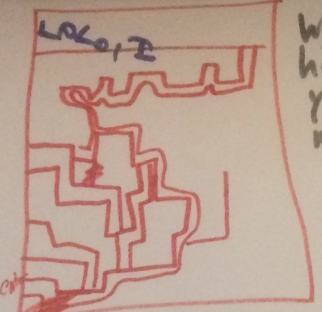
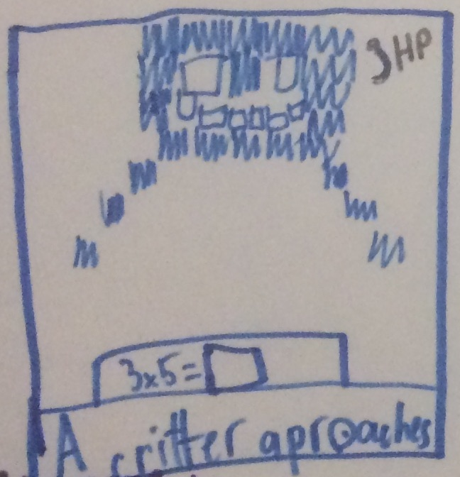
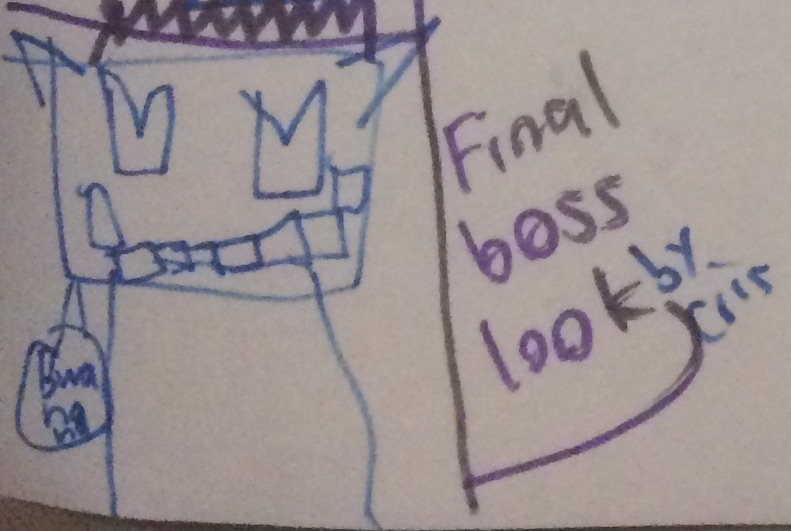
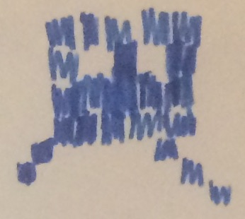

A scratch game for Cub Scout Pack 163, Den 3/7

Spring 2017

[Scratch project page](https://scratch.mit.edu/projects/148953234/)

# Design

[Full design poster](fullposter.jpg)

## Core gameplay

The player navigates a hero through a maze.  Along the way he meets critters.
When the hero meets a critter, the critter challenges the hero with a math fact.
If the player gets the problem right, the critter disappears.  If he gets it
wrong, the player goes back to the start of the maze or his most recent checkpoint.

At the end of each maze, the player must battle a boss.  The boss presents 
a series of math problems.  Each correctly solved math problem results in damage to
the boss until he is defeated.

Successive levels can be harder by a more complicated maze, more critters, and bosses
with more hit points.  

## Extra features

If we can figure the core gameplay out, we can explore these options:

* Choose your avatar: alien, grandma, Elvis, ... ?

* multiplication and division math facts?

* Cut scenes.

# Implementation

## Element specification

The hero and critters are sprites.  The maze exit could be another sprite, or
perhaps a special color.

The maze, critter encounter, and boss battle modes are different backdrops.

Sprites vary in size, but 100x100 seems right.  Since the library contains bitmap and
vector sprites, I assume they can be either.  SVG maybe?  

Backdrops are 480x360.  Some options for maze grid:

 * 16x12 of 30px per side (25px hall, 5px wall)

 * 15x10 of 36px per side  (30px hall, 6px wall)

 * 12x9 of 40px per side

 * 8x6 of 60px per side

A finer grid should make harder gameplay.

## Game modes

### Maze Navigation

The hero starts at an initial position.  The critters start at an initial position.
The maze exit is marked.  

Upon maze start, a number of critters spawn at regular intervals.  The number of
critters depends on the maze level.

The hero uses arrow keys to navigate the maze.  The move script listens for keypresses,
checks if the ordered move is "legal" (not into a wall), and then moves in the right
direction.

The critter(s) are moving in the maze, towards the hero.  This [maze algorithm](https://scratch.mit.edu/projects/53990658/#player) 
by RestroD has an implementation with Dijkstra's method.

If a critter meets a hero, we move to Critter Encounter mode with a backdrop change
and/or messge broadcast.

### Critter Encounter

Backdrop changes, closeup on the critter.  We can use a clone of the sprite here, at 
a larger size and in the middle of the backdrop.

The critter generates a random math fact and asks the hero to solve it.  We can use
the Ask and Wait block for that.

If the answer is correct, the critter gives an affirmative message.  Maybe it makes
a celebratory gesture with a costume change.  The game back to Maze Navigation mode,
but the critter either vanishes or moves back to its initial position.  Maybe it 
respawns later.

If the answer is incorrect, the critter gives a negative message, possible gesture.
The game goes back to Maze Navigation mode, but the player is moved back to his 
starting position.

### Boss Battle

Backdrop changes, closeup on the boss.  The boss has a health register that
depends on the level.  

Until the health register is zero... the boss generates a random math fact and 
asks the hero to solve it. If the answer is correct, the boss takes a hit and the
damage register goes down.  If the answer is incorrect ... does the hero have 
a damage register too?  Maybe a time limit?

If the player health reaches zero, he goes back to the beginning of the level.
If the boss health reaches zero, he goes to the next level.  

### Cut scenes

These can be any kind of animation.  They can go at the start of the game,
between levels, at the end of the game.

# Tasks

There are five developers: Felix ([Glitchypixels](https://scratch.mit.edu/users/Glitchypixles/)), 
Christopher ([AwesomeKidGamerz](https://scratch.mit.edu/users/AwesomeKidGamerz/)), 
Kieran ([KMan21207](https://scratch.mit.edu/users/KMan21207/)), 
Liam ([iplayagario](https://scratch.mit.edu/users/iplayagario/)), Ethan (no username yet).
Matthew is [sympleko](https://scratch.mit.edu/users/sympleko/) on Scratch.

I formed a studio on Scratch: [Pack 163 Den 3/7](https://scratch.mit.edu/studios/3885613/projects/).
The way collaboration works on Scratch is that people *Remix* the main project, work on their versions,
then *Share* when they are finished.  I will be able to copy in the changed parts of each individual's
project into the main project.

## Maze design

Liam, Kieran, and Ethan are designing mazes.  Note these specifications!

* Mazes (backdrops) must be 480x360 pixels in size.
  If the backdrop is created in scratch, this is the default.
* Passageways should be at least 50 pixels wide so the characters
  can get through.
* The maze walls need to be drawn in red (`#CC0000`) for them to be 
  recognized as walls.

Artwork can be done within the Scratch editor or an external program.

## Hero art

We are putting this on the backburner and using Scratchy the cat for now.

If in the future we want to add this feature, adding costumes might be 
the best way. 

## Critter art

Christopher is in charge of critters.

The critter is displayed at 50% in the maze and 200% in the encounter.
So he should fit in a 100x100px box.  Ideally vector rather than bitmap
(so he scales nicely).

He could have different costumes:

 * smiling

 * frowning

 * questioning (eyebrows raised)

 * shrieking ("Oh nooooooo")

## Boss art

Ethan is in charge of boss art.  Ideally we want as many bosses as mazes.

## Cut scenes

Liam is in charge.  Opening and closing.  Animated text.  Sounds, maybe?
Squirrels spitting lightning bolts?

## Scripting

Matthew and Felix.

* Hero maze navigation:

  - legal movement: done

  - back to start: done with one glitch

  - trigger boss battle: done 

* Critter movement

  - towards hero (Dijkstra): not yet.  So far just random.

  - trigger critter encounter: done

* Critter encounter

  - Pose question

  - check answer and react.

* Boss battle: todo

  - health bar

  - question loop

  - check answer, react

  - result choice

